# ResistanceIQ — Production Authentication & User Account System Architecture

## Executive Summary

ResistanceIQ is transitioning from development/mock identity patterns (`Dr. Priya Mehta`, `analyst@bindwell.bio`, fallback tokens) to an enterprise-grade multi-tenant authentication, user account, and Role-Based Access Control (RBAC) architecture.

This document specifies:
1. Current vs. Target Authentication Architecture
2. Database Schema Changes & Migrations
3. REST API Endpoint Specifications & Contracts
4. Cryptographic & Session Security Design
5. RBAC Permission Matrix & Server-Side Enforcement
6. Database Migration Plan
7. Automated Testing Plan

---

## 1. Current vs. Target Authentication Architecture

```mermaid
graph TD
    subgraph Current Architecture
        A1[Frontend Store with Default Mock User] -->|Auto Dev Fallback| B1[API Client Injects Hardcoded Credentials]
        B1 --> C1[FastAPI get_current_user grabs first User in DB if unauthenticated]
        C1 --> D1[Single static organization assumed]
    end

    subgraph Target Production Architecture
        A2[Unauthenticated User] --> B2[Login / Register UI]
        B2 -->|POST /api/v1/auth/login or /register| C2[FastAPI Auth Gateway]
        C2 -->|Bcrypt/Argon2id + JWT Signing| D2[HttpOnly Cookie / Secure JWT Session]
        D2 -->|GET /api/v1/auth/me| E2[Frontend Auth State Machine]
        E2 --> F2[Protected Routes + Real Profile + Multi-Tenant DB Scoping]
    end
```

---

## 2. Database Changes & Entity Schema

### A. Users Table (`users`)
| Column | Type | Constraints | Description |
| :--- | :--- | :--- | :--- |
| `id` | `VARCHAR(36)` | PK, UUID | Unique user identifier |
| `organization_id` | `VARCHAR(36)` | FK(`organizations.id`), Not Null, Index | Organization membership |
| `email` | `VARCHAR(255)` | Unique, Not Null, Index | Normalized corporate email (lowercase) |
| `hashed_password` | `VARCHAR(255)` | Not Null | Bcrypt password hash |
| `first_name` | `VARCHAR(64)` | Nullable | User's given name |
| `last_name` | `VARCHAR(64)` | Nullable | User's family name |
| `display_name` | `VARCHAR(128)` | Nullable | Custom display identity |
| `full_name` | `VARCHAR(128)` | Not Null | Computed/stored full name |
| `role` | `ENUM` | Not Null, Default `ANALYST` | `ADMIN`, `RESEARCHER`, `ANALYST`, `VIEWER` |
| `is_active` | `BOOLEAN` | Default `True`, Index | Account status flag |
| `email_verified` | `BOOLEAN` | Default `False`, Index | Email verification status |
| `email_verification_token` | `VARCHAR(255)` | Nullable, Index | Hashed single-use email verification token |
| `email_verification_expires_at`| `DATETIME` | Nullable | Token expiration |
| `password_reset_token` | `VARCHAR(255)` | Nullable, Index | Hashed single-use password reset token |
| `password_reset_expires_at`| `DATETIME` | Nullable | Password reset expiration |
| `invitation_token` | `VARCHAR(255)` | Nullable, Index | Hashed organization invitation token |
| `invitation_expires_at` | `DATETIME` | Nullable | Invitation expiration |
| `last_login_at` | `DATETIME` | Nullable | Timestamp of last successful sign-in |
| `created_at` | `DATETIME` | Default `UTC NOW` | Account creation timestamp |
| `updated_at` | `DATETIME` | Default `UTC NOW` | Account modification timestamp |

### B. Organizations Table (`organizations`)
| Column | Type | Constraints | Description |
| :--- | :--- | :--- | :--- |
| `id` | `VARCHAR(36)` | PK, UUID | Unique organization identifier |
| `name` | `VARCHAR(128)` | Not Null | Corporate entity name |
| `slug` | `VARCHAR(128)` | Unique, Not Null, Index | URL-safe workspace slug |
| `plan_tier` | `VARCHAR(32)` | Default `ENTERPRISE_PRO` | Billing/feature tier |
| `created_at` | `DATETIME` | Default `UTC NOW` | Creation timestamp |
| `updated_at` | `DATETIME` | Default `UTC NOW` | Modification timestamp |

### C. Audit Logs Table (`activity_logs` / `audit_logs`)
| Column | Type | Constraints | Description |
| :--- | :--- | :--- | :--- |
| `id` | `VARCHAR(36)` | PK, UUID | Unique audit event identifier |
| `user_id` | `VARCHAR(36)` | FK(`users.id`), Nullable, Index | Acting user |
| `organization_id` | `VARCHAR(36)` | FK(`organizations.id`), Nullable, Index | Tenant organization |
| `event_type` | `VARCHAR(64)` | Not Null, Index | E.g., `USER_LOGIN`, `FORECAST_CREATED`, `ROLE_CHANGED` |
| `resource_type` | `VARCHAR(64)` | Nullable | E.g., `FORECAST`, `PROJECT`, `USER`, `API_KEY` |
| `resource_id` | `VARCHAR(64)` | Nullable | ID of target resource |
| `ip_address` | `VARCHAR(45)` | Nullable | Client IPv4 / IPv6 |
| `user_agent` | `VARCHAR(255)` | Nullable | Client browser / device string |
| `details` | `TEXT` | Nullable | Structured JSON metadata |
| `created_at` | `DATETIME` | Default `UTC NOW`, Index | Timestamp |

---

## 3. REST API Endpoint Specifications

### Authentication Routes (`/api/v1/auth`)

| Endpoint | Method | Role Req | Request Payload | Response / Status | Purpose |
| :--- | :--- | :--- | :--- | :--- | :--- |
| `/register` | `POST` | Public | `first_name`, `last_name`, `email`, `organization_name`, `password`, `confirm_password` | `201 Created` (`user`, `verification_token`) | Registers new tenant org & primary admin user |
| `/login` | `POST` | Public | `email`, `password` | `200 OK` (`access_token`, `refresh_token`, `user`) | Authenticates user & issues session tokens |
| `/logout` | `POST` | Authenticated | None | `200 OK` (`message`) | Revokes tokens & invalidates session |
| `/refresh` | `POST` | Public | `refresh_token` | `200 OK` (`access_token`) | Issues fresh short-lived access token |
| `/forgot-password` | `POST` | Public | `email` | `200 OK` (Safe generic message) | Dispatches single-use reset token |
| `/reset-password` | `POST` | Public | `token`, `new_password` | `200 OK` (`message`) | Resets password using valid token |
| `/verify-email` | `POST` | Public | `token` | `200 OK` (`message`) | Verifies email address |
| `/me` | `GET` | Authenticated | None | `200 OK` (`UserRead` with `organization` & permissions) | Returns current authenticated user profile |
| `/profile` | `PATCH` | Authenticated | `first_name`, `last_name`, `display_name` | `200 OK` (`UserRead`) | Updates personal profile fields |
| `/change-password` | `POST` | Authenticated | `current_password`, `new_password` | `200 OK` (`message`) | Changes password for authenticated user |

### User Management Routes (`/api/v1/settings/users`)

| Endpoint | Method | Role Req | Request Payload | Response / Status | Purpose |
| :--- | :--- | :--- | :--- | :--- | :--- |
| `/settings/users` | `GET` | `ADMIN` | None | `200 OK` (`List[UserRead]`) | Lists organization members |
| `/settings/users/invite` | `POST` | `ADMIN` | `email`, `full_name`, `role` | `201 Created` (`invitation_token`, `expires_in_days`) | Invites new user to organization |
| `/settings/users/{id}/role`| `PATCH`| `ADMIN` | `role` (`ADMIN`, `RESEARCHER`, `ANALYST`, `VIEWER`) | `200 OK` (`UserRead`) | Updates user role permissions |
| `/settings/users/{id}/deactivate` | `POST` | `ADMIN` | None | `200 OK` (`UserRead`) | Deactivates user account |
| `/settings/users/{id}/reactivate` | `POST` | `ADMIN` | None | `200 OK` (`UserRead`) | Reactivates user account |
| `/settings/users/{id}` | `DELETE` | `ADMIN` | None | `200 OK` (`message`) | Removes user from organization |

---

## 4. Cryptographic Security & Session Design

1. **Password Hashing**: Bcrypt with salted rounds ($2^{12}$) or Argon2id. Plaintext passwords never logged or stored.
2. **Password Policy Enforcement**:
   - Minimum length: 8 characters
   - At least 1 uppercase letter (`[A-Z]`)
   - At least 1 lowercase letter (`[a-z]`)
   - At least 1 digit (`[0-9]`)
   - At least 1 special character (`[!@#$%^&*(),.?":{}|<>]`)
3. **JWT Access Tokens**:
   - Alg: HS256 (or RS256 in production)
   - Expiration: Short-lived (60–120 minutes)
   - Claims: `sub` (User ID), `org_id` (Tenant ID), `role` (UserRole), `exp`, `iat`
4. **JWT Refresh Tokens**:
   - Cryptographically random 64-byte url-safe token stored as SHA-256 hash in DB with 14-day expiry.
5. **Session Expiration & Re-authentication**:
   - Expired access tokens automatically trigger refresh flow. If refresh token is expired or revoked, user is transitioned to `session_expired` state and redirected to `/login` with notification: *"Your session has expired. Please sign in again."*
6. **Enumeration Protection**:
   - `POST /api/v1/auth/forgot-password` always returns status 200 with the exact same response regardless of whether the email exists in the database.

---

## 5. RBAC Permission Matrix

| Capability / Action | Minimum Role Required | Backend Enforcement |
| :--- | :--- | :--- |
| View Forecasts, Backtests, Explorer | `VIEWER` | `require_role([VIEWER, ANALYST, RESEARCHER, ADMIN])` |
| Run Resistance Forecasts & Compare | `ANALYST` | `require_role([ANALYST, RESEARCHER, ADMIN])` |
| Create Projects, Datasets & Reports | `RESEARCHER`| `require_role([RESEARCHER, ADMIN])` |
| Manage Workspace, Users & API Keys | `ADMIN` | `require_role([ADMIN])` |
| Access Audit Logs & Model Controls | `ADMIN` | `require_role([ADMIN])` |

---

## 6. Migration Plan

1. Create migration `005_production_auth_rbac_audit_schema.py`:
   - Adds `display_name`, `email_verification_token`, `email_verification_expires_at` to `users`.
   - Adds `organization_id`, `event_type`, `resource_type`, `resource_id`, `ip_address`, `user_agent` to `activity_logs`.
   - Updates `UserRole` enum type definition for `RESEARCHER`.
2. Apply migration using `alembic upgrade head`.
3. Verify data preservation of existing models and relationships.

---

## 7. Automated Testing Plan

Test suite `tests/test_production_auth_rbac_system.py` covering:
1. `test_user_registration_success`: Creates new user + tenant org.
2. `test_user_registration_weak_password_rejected`: Enforces password complexity rules.
3. `test_user_registration_duplicate_email_rejected`: Returns 409 Conflict.
4. `test_email_verification_flow`: Issues token and verifies email.
5. `test_login_success_and_last_login_update`: Verifies bcrypt hash and updates timestamp.
6. `test_login_invalid_password`: Returns 401 Unauthorized.
7. `test_login_deactivated_user`: Returns 403 Forbidden.
8. `test_get_current_user_me`: Returns real user, organization, and permissions.
9. `test_password_reset_flow`: Forgot password $\to$ token $\to$ reset password $\to$ login with new password.
10. `test_admin_user_invitation_and_acceptance`: Admin invites $\to$ user accepts and sets password.
11. `test_rbac_role_enforcement`: Viewer cannot create projects; Researcher can; Admin can manage users.
12. `test_multi_tenant_organization_isolation`: Org A user cannot see or modify Org B projects/forecasts.
13. `test_audit_logging_capture`: Authentication and administrative events recorded in `activity_logs`.
