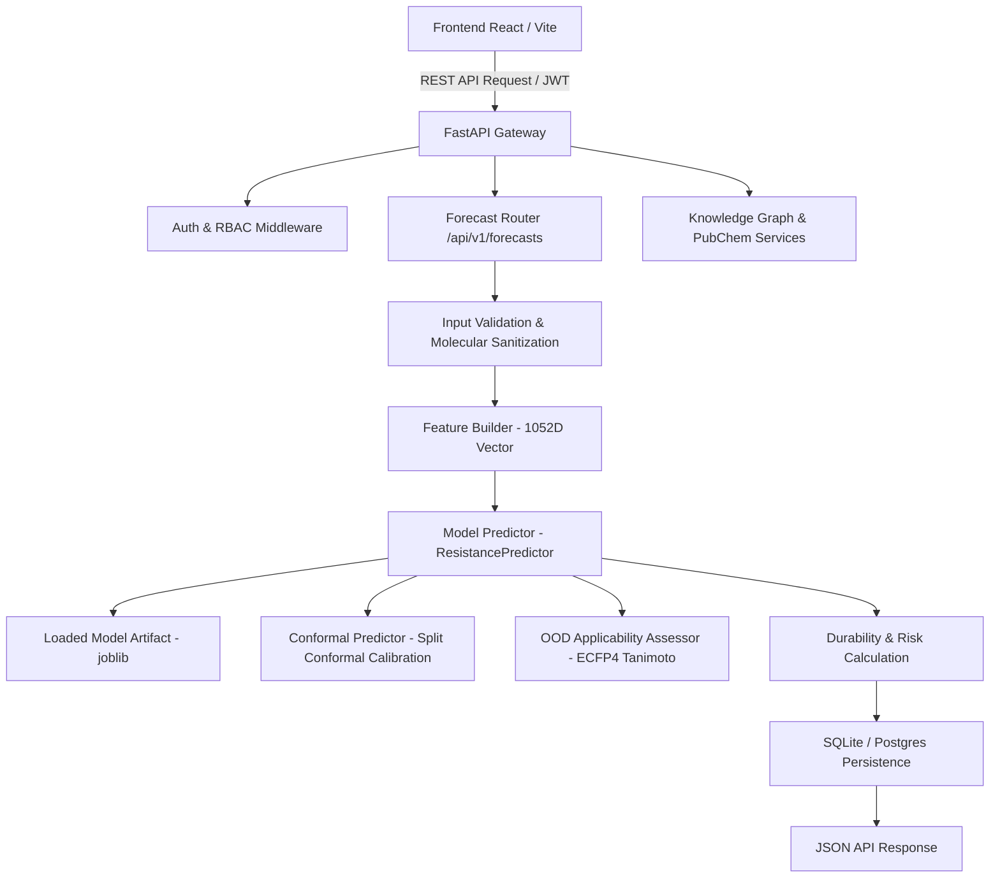

# ResistanceIQ — Production ML & Real Forecast Engine Audit
**Document**: `PRODUCTION_ML_AUDIT.md`  
**Platform Version**: v1.0.0 → v2.0.0 Productionization  
**Audit Timestamp**: 2026-08-19  

---

## 1. Current Architecture Overview

### Component Breakdown:
1. **Frontend**: React 19 + Vite 8 SPA (`src/` and `resistanceiq/frontend/src/`) communicating with FastAPI over HTTP.
2. **Backend**: FastAPI app with SQLAlchemy ORM, SQLite (`resistanceiq_dev.db`) database, telemetry, and structured logging.
3. **Cheminformatics Engine**: RDKit (`Chem`, `rdMolStandardize`, `AllChem`, `Descriptors`, `MolDraw2DSVG`) and PubChem PUG REST API client with local database caching (`PubChemCache`).
4. **Target Knowledge Graph**: FAO ICC crops, NCBI taxonomy, UniProtKB protein records, and RCSB PDB structure mapping.
5. **Inference Pipeline**: `ml.inference.predictor.ResistancePredictor` loading serialized `.joblib` models from `storage/models`.

---

## 2. Current Model & Feature Specifications

- **Current Default Model**: `v1.0.0-ridge-ecfp4` (Ridge Regression, $\alpha=1.0$)
- **Feature Vector Dimensionality**: 1,052 dimensions
  - **1,024 dimensions**: Morgan circular molecular fingerprints (ECFP4, radius=2, nBits=1024)
  - **6 dimensions**: Physicochemical descriptors (Molecular Weight, MolLogP, TPSA, H-Bond Donors, H-Bond Acceptors, Rotatable Bonds)
  - **22 dimensions**: One-hot categorical biological and assay features (IRAC Mode of Action group, pest taxonomic order, bioassay method, temporal year encodings)

---

## 3. Current Dataset & Temporal Evaluation

- **Total Historical Benchmark Records**: 44 canonical records
- **Temporal Out-of-Time Partitioning**:
  - **Training Split ($\le 2000$)**: 22 records
  - **Validation Split ($2001 - 2010$)**: 12 records
  - **Test Split ($2011 - 2026$)**: 10 records
- **Evaluation Target**: $\log_{10}(\text{Resistance Ratio})$ where Resistance Ratio $\text{RR} = \frac{\text{LC}_{50}(\text{Field/Selected})}{\text{LC}_{50}(\text{Susceptible Baseline})}$
- **Current Test Metrics (Honest Baseline)**:
  - **Mean Absolute Error (MAE)**: $0.4954\ \log_{10}(\text{RR})$
  - **Root Mean Squared Error (RMSE)**: $0.5868\ \log_{10}(\text{RR})$
  - **Coefficient of Determination ($R^2$)**: $-0.2930$
  - **Current Scientific Status**: `REQUIRES VALIDATION`

> [!IMPORTANT]
> **Scientific Truth & Zero Fabrication**:  
> The negative $R^2$ on the 10 held-out temporal test samples from the 44-record dataset honestly reflects sample sparsity and regime shifts over time. The platform must never disguise this metric or claim production validation until an expanded, deduplicated, and rigorously benchmarked dataset is loaded and validated across multiple model families.

---

## 4. Current Weaknesses & Architectural Gaps

1. **Dataset Size**: 44 records is insufficient for statistical generalization across diverse chemical classes and pest orders.
2. **Model Diversity**: Relying solely on a single Ridge linear baseline without systematically benchmarking nonlinear tree ensembles (Random Forest, Gradient Boosting, HistGradientBoosting).
3. **OOD Visibility**: Out-of-domain predictions must never be silently masked or returned as normal predictions; they must explicitly trigger `OOD_WARNING` badges and notifications.
4. **Uncertainty Language**: Conformal prediction bounds must be rigorously termed `90% Resistance-Ratio Prediction Interval` (not "confidence intervals").
5. **Endpoint Parity**: Missing dedicated endpoints for `/api/v1/models/active`, `/api/v1/models/{model_version}/health`, and `/api/v1/features/preview`.
6. **Frontend State Synchronization**: Wizard execution state machine must strictly reflect actual backend steps (`IDLE` $\to$ `VALIDATING` $\to$ `RESOLVING_COMPOUND` $\to$ `RESOLVING_TARGET` $\to$ `GENERATING_FEATURES` $\to$ `RUNNING_MODEL` $\to$ `CALIBRATING_UNCERTAINTY` $\to$ `PERSISTING_RESULT` $\to$ `COMPLETE`) with zero hardcoded timers or fake loading steps.

---

## 5. Missing Production Components

| Component | Current State | Required Production State |
| :--- | :--- | :--- |
| **Model Registry** | Basic filesystem scan of `.joblib` files | Formal `ModelRegistry` class tracking model IDs, versions, algorithms, metrics, dataset versions, and lifecycle statuses (`candidate`, `validated`, `production`, `retired`) |
| **Active Model Health API** | Generic list endpoint | Dedicated `GET /api/v1/models/active` and `GET /api/v1/models/{version}/health` with integrity SHA-256 checks and latency probing |
| **Feature Preview API** | Not exposed | `POST /api/v1/features/preview` returning 1052-D vector breakdown and active ECFP4 bit list |
| **Data Ingestion Pipeline** | 44 raw CSV records | Versioned APRD (Arthropod Pesticide Resistance Database) ingestion with strict schema, deduplication, MOA normalization, taxonomy normalization, and audit trails |
| **Temporal Data Leakage Auditor** | Basic split function | Strict temporal leakage audit verifying zero chemical/species overlap between train and test sets, generating an immutable audit report |
| **Multi-Model Benchmark Suite** | Ad-hoc script | Automated benchmark training Ridge, Random Forest, Gradient Boosting (GBRT), and HistGradientBoosting with temporal nested cross-validation |
| **Safety & Error Handling** | FastAPI basic handlers | Sanitized user-facing error messages with server-side correlation IDs, completely masking internal stack traces and database SQL |

---

## 6. Implementation Sequence

1. **Phase 1 — REST API & Endpoint Contracts**:
   - Implement `POST /api/v1/forecasts`, `GET /api/v1/forecasts/{forecast_id}`, `GET /api/v1/models/active`, `GET /api/v1/models/{model_version}/health`, `GET /api/v1/health`, `POST /api/v1/features/preview`.
   - Ensure complete execution pipeline: Validation $\to$ Chemical $\to$ Target $\to$ Structure $\to$ Features $\to$ Inference $\to$ OOD $\to$ Uncertainty $\to$ Durability $\to$ Persistence $\to$ Response.
2. **Phase 2 — Mock / Demo Elimination**:
   - Verify zero static predictions or `Math.random` fallbacks in the production inference path.
3. **Phase 3 — Versioned Data Ingestion & Dataset Expansion**:
   - Standardize and ingest expanded APRD dataset records with full provenance (`data/raw/`, `data/processed/`, `data/splits/`).
4. **Phase 4 — Data Leakage Prevention**:
   - Strict temporal partitioning (Train $\le 2012$, Val $2013-2017$, Test $2018-2026$) with group-level audits.
5. **Phase 5 — Model Benchmarking & Model Registry**:
   - Train and compare Ridge, Random Forest, GBRT, and HistGradientBoosting.
   - Record validation metrics (MAE, RMSE, $R^2$, Median AE) and subgroup performance.
6. **Phase 6 — Conformal Prediction & OOD Detection**:
   - Calibrate 90% Prediction Intervals ($q_{\text{hat}}$) and ECFP4 Tanimoto neighborhood applicability domain.
7. **Phase 7 — Frontend State Machine & Results Display**:
   - Synchronize UI states with backend execution and render scientific results (Durability, Horizon, 90% Prediction Interval, OOD status, Research/Validation status).
8. **Phase 8 — Automated Testing & Verification**:
   - Unit tests, integration tests, and end-to-end user-input to persisted forecast tests.
