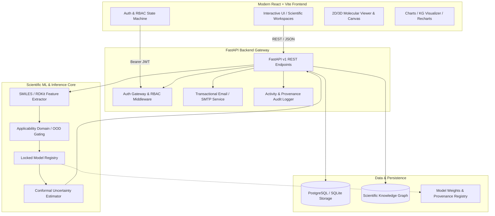
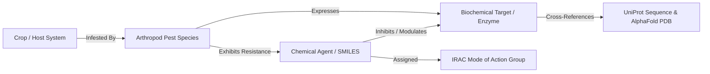

# ResistanceIQ — AI-Powered Pesticide Resistance Forecasting & Scientific Intelligence Platform

[](https://python.org)
[](https://fastapi.tiangolo.com)
[](https://reactjs.org)
[](https://vitejs.dev)
[]()
[]()

> **CRITICAL SCIENTIFIC & REGULATORY DISCLAIMER**  
> ResistanceIQ is an academic and translational research platform designed for computational hypothesis generation and resistance risk screening.  
> **Operational Mode: RESEARCH / VALIDATION MODE**  
> **Scientific Governance Status: REQUIRES VALIDATION**  
> This platform and its candidate machine learning models are **NOT** regulatory-approved, **NOT** certified for commercial agricultural advisory, and do **NOT** establish definitive toxicological or biochemical laws. Computational predictions must be experimentally validated via standardized bioassays (e.g., FAO/IRAC susceptibility protocols) and field trials prior to operational decision-making.

---

## Table of Contents
1. [Overview & Research Purpose](#overview--research-purpose)
2. [Core Capabilities](#core-capabilities)
3. [System Architecture](#system-architecture)
4. [Scientific Knowledge Graph](#scientific-knowledge-graph)
5. [Molecular Intelligence & Predictive Modeling](#molecular-intelligence--predictive-modeling)
6. [Applicability Domain & Out-of-Distribution (OOD) Detection](#applicability-domain--out-of-distribution-ood-detection)
7. [Conformal Uncertainty & Risk Bounds](#conformal-uncertainty--risk-bounds)
8. [Research Prioritization Engine](#research-prioritization-engine)
9. [Dataset & Model Governance](#dataset--model-governance)
10. [Technology Stack](#technology-stack)
11. [Repository Structure](#repository-structure)
12. [Installation & Setup](#installation--setup)
13. [Environment Configuration](#environment-configuration)
14. [Running the Application](#running-the-application)
15. [Running the Test Suite](#running-the-test-suite)
16. [Production Build](#production-build)
17. [API Overview](#api-overview)
18. [Security Hardening & Key Management](#security-hardening--key-management)
19. [Known Limitations](#known-limitations)
20. [Licensing & Data Attribution](#licensing--data-attribution)

---

## 1. Overview & Research Purpose

Arthropod pesticide resistance poses a multi-billion dollar threat to global food security and sustainable pest management. Traditional resistance monitoring relies on reactive field sampling and laboratory bioassays, often discovering resistance phenotypes only after control failures occur in the field.

**ResistanceIQ** is an end-to-end computational intelligence system that unifies:
- Structured toxicological databases (APRD, ChEMBL, PubChem)
- Target biology and protein sequence knowledge (UniProt, AlphaFold, PDB)
- Crop-pest agronomic ontologies (FAO ICC, IRAC Mode of Action)
- Machine learning models parameterized on cheminformatics features (Morgan / ECFP4 fingerprints, physicochemical descriptors)
- Rigorous conformal uncertainty estimation and applicability domain gating

The primary goal is proactive computational screening: identifying potential cross-resistance risks, evaluating novel candidate chemistries against resistant targets, and prioritizing biochemical assays based on rigorous uncertainty bounds.

---

## 2. Core Capabilities

- **Crop → Pest → Target → Protein → Structure Traversal**: Full ontological traversal connecting agricultural commodities down to atomic coordinate structures.
- **Cheminformatics Engine**: Real-time SMILES parsing, canonicalization, RDKit/custom descriptor computation, and 2048-bit ECFP4 fingerprint generation.
- **Multivariate Resistance Forecasting**: Predicts Resistance Ratio (Log10 RR) and categorical risk levels with baseline Gradient Boosted Regression Trees (GBRT) and Random Forest ensembles.
- **Applicability Domain & OOD Scoring**: Distance-to-training-manifold evaluation using Tanimoto maximum similarity and Mahalanobis feature distance to detect novel scaffolds.
- **Conformal Prediction**: Distribution-free coverage guarantees providing 80%, 90%, and 95% confidence intervals on predicted resistance ratios.
- **Evidence-Weighted Hypothesis Ranking**: Combines structural evidence, bioassay density, and target mutation frequency to prioritize candidate molecules.
- **Enterprise-Grade Authentication & RBAC**: Secure Argon2id/Bcrypt password hashing, short-lived JWT access tokens, cryptographically secure OTP password recovery, and multi-role access control (Admin, Lead Scientist, Researcher, Analyst, Viewer).
- **Comprehensive Auditability & Export**: Deterministic report generation (PDF, CSV, JSON) with cryptographic model provenance hashes.

---

## 3. System Architecture



---

## 4. Scientific Knowledge Graph

ResistanceIQ models the complex interactions between agricultural commodities, pest biology, biochemical targets, and chemical agents using a directional scientific graph:



### Key Ontological Entities:
- **Crops**: Harmonized with FAO Indicative Crop Classification (ICC v1.1).
- **Pests**: Arthropod species taxonomy with regional occurrence tracking.
- **Targets**: Acetylcholinesterase (AChE), Voltage-Gated Sodium Channel (VGSC), Ryanodine Receptor (RyR), GABA Receptors, Cytochrome P450 monooxygenases (CYP), and Glutathione S-transferases (GST).
- **Compounds**: Standardized SMILES, IUPAC nomenclature, PubChem CID, and IRAC MoA classification.

---

## 5. Molecular Intelligence & Predictive Modeling

ResistanceIQ extracts chemical information directly from SMILES representations:

1. **Preprocessing & Normalization**: Strips salts, normalizes charges, canonicalizes stereochemistry, and validates valence.
2. **Feature Extraction**:
   - 2048-bit Extended-Connectivity Fingerprints (ECFP4 / Morgan radius 2).
   - Physicochemical descriptors: Molecular Weight, LogP (Wildman-Crippen), Topological Polar Surface Area (TPSA), Rotatable Bond Count, Hydrogen Bond Donors/Acceptors, Aromatic Ring Count.
   - Interaction terms: Formulation matrix effects, target mutation flags, and temporal historical pressure indices.
3. **Inference Pipeline**:
   - Continuous Prediction: $\log_{10}(\text{Resistance Ratio})$ where $\text{RR} = \frac{LC_{50}(\text{Resistant})}{LC_{50}(\text{Susceptible})}$.
   - Categorical Tiering:
     - **Low Resistance**: $\text{RR} < 5$ ($\log_{10} \text{RR} < 0.70$)
     - **Moderate Resistance**: $5 \le \text{RR} \le 20$ ($0.70 \le \log_{10} \text{RR} \le 1.30$)
     - **High Resistance**: $\text{RR} > 20$ ($\log_{10} \text{RR} > 1.30$)

---

## 6. Applicability Domain & Out-of-Distribution (OOD) Detection

Machine learning models frequently fail silently when presented with chemical scaffolds distant from their training distribution. ResistanceIQ implements explicit applicability domain gating:

- **Tanimoto Maximum Similarity**: Measures maximum fingerprint overlap against the training reference set.
- **Mahalanobis Feature Distance**: Evaluates distance in standardized physicochemical space.
- **OOD Risk Classification**:
  - `IN_DOMAIN` ($S_{\text{max}} \ge 0.70$): Standard prediction confidence.
  - `BORDERLINE` ($0.50 \le S_{\text{max}} < 0.70$): Increased conformal bounds; advisory flag added.
  - `OUT_OF_DOMAIN` ($S_{\text{max}} < 0.50$): Model inference flagged as high-uncertainty extrapolation; experimental bioassay required.

---

## 7. Conformal Uncertainty & Risk Bounds

To provide reliable probabilistic guarantees, ResistanceIQ employs Split Conformal Prediction (inductive conformal inference) calibrated on held-out temporal validation folds:

$$\Gamma^{\alpha}(x) = \left[ \hat{y}(x) - q_{1-\alpha}, \; \hat{y}(x) + q_{1-\alpha} \right]$$

- Guarantees marginal coverage: $P(y \in \Gamma^{\alpha}(x)) \ge 1 - \alpha$.
- Generates dynamic prediction intervals for $\alpha \in \{0.20, 0.10, 0.05\}$ (80%, 90%, and 95% coverage).

---

## 8. Research Prioritization Engine

To optimize laboratory screening throughput, candidates are scored via a multi-criteria prioritization index:

$$\text{Priority Score} = w_1 (1 - \hat{P}_{\text{resistance}}) + w_2 (S_{\text{domain}}) + w_3 (Q_{\text{evidence}}) - w_4 (\sigma_{\text{uncertainty}})$$

This highlights candidate chemistries that possess high predicted efficacy against target pests while remaining within confident applicability regions.

---

## 9. Dataset & Model Governance

### Locked Production Benchmark Artifact
- **Model Identifier**: `v2.0.0-gbrt-ecfp4.joblib`
- **Expected SHA256**: `6fc915fa26716dc4a06bad71f586af95ee071acf11e9a5b8acdc5171fed55622`
- **Validation Status**: `REQUIRES VALIDATION`
- **Operational Mode**: `RESEARCH / VALIDATION MODE`

### Data Manifests
All training splits and canonical dataset transformations maintain cryptographic manifests in `resistanceiq/data/metadata/`:
- `baseline_v2_checksums.json`
- `aprd-resistance-v2_manifest.json`
- `aprd-resistance-v3_manifest.json`
- `aprd-resistance-v4_manifest.json`

---

## 10. Technology Stack

- **Backend**: Python 3.11+, FastAPI, SQLAlchemy, Pydantic v2, Alembic, Uvicorn, Bcrypt/Passlib, PyJWT, ReportLab.
- **Cheminformatics & ML**: RDKit, Scikit-learn, NumPy, SciPy, Joblib.
- **Frontend**: React 18, Vite 6, TailwindCSS, Lucide React, Recharts, Canvas API.
- **Testing & QA**: Pytest, Pytest-Asyncio, HTTPX, ESLint, Playwright / Node E2E suites.

---

## 11. Repository Structure

```
.
├── .env.example                     # Environment template with safe placeholders
├── .gitignore                       # Multi-layer exclusion policy (secrets, db, logs, node_modules)
├── README.md                        # Master documentation & scientific governance
├── index.html                       # Frontend entry point
├── package.json                     # Frontend dependencies & build scripts
├── vite.config.js                   # Vite configuration & dev proxy
├── tailwind.config.js               # Tailwind CSS theme configuration
├── eslint.config.js                 # ESLint configuration
├── src/                             # React application source
│   ├── api/                         # Backend API integration clients
│   ├── components/                  # UI components, layout, molecular visualizers
│   ├── context/                     # Auth and application state contexts
│   └── pages/                       # Application views & dashboards
├── resistanceiq/                    # Core platform package
│   ├── backend/                     # FastAPI backend
│   │   ├── app/                     # Core application, routers, services, models
│   │   │   ├── api/v1/              # Versioned API routes
│   │   │   ├── auth/                # Security, RBAC, password reset handlers
│   │   │   ├── core/                # Configuration & database session setup
│   │   │   ├── db/                  # Base models & session dependencies
│   │   │   ├── ingestion/           # Data ingestion, parsers, validators
│   │   │   ├── models/              # SQLAlchemy database entities
│   │   │   ├── schemas/             # Pydantic validation schemas
│   │   │   └── services/            # Email, forecast, reports, and knowledge graph services
│   │   └── migrations/              # Alembic database migrations
│   ├── data/                        # Scientific reference datasets & metadata manifests
│   ├── docs/                        # In-depth architectural & scientific specifications
│   ├── ml/                          # Cheminformatics & ML inference pipelines
│   ├── storage/                     # Model weights & report storage
│   └── tests/                       # Comprehensive Pytest suite
└── docs/                            # Architectural documentation
```

---

## 12. Installation & Setup

### Prerequisites
- Python 3.11 or higher
- Node.js 18+ and npm 9+
- Git

### Clone Repository
```bash
git clone https://github.com/<your-username>/ResistanceIQ.git
cd ResistanceIQ
```

---

## 13. Environment Configuration

1. Copy `.env.example` to `.env`:
```bash
cp .env.example .env
```
2. Configure required environment parameters in `.env`:
   - `JWT_SECRET`: Minimum 32-character random string.
   - `DATABASE_URL`: `sqlite:///./resistanceiq_dev.db` for development, or PostgreSQL connection string for production.
   - `EMAIL_PROVIDER`: `smtp` or `dev` (defaults to local mailbox in development).
   - `SMTP_HOST`, `SMTP_PORT`, `SMTP_USERNAME`, `SMTP_PASSWORD`: SMTP credentials for real email delivery.

---

## 14. Running the Application

### Start the Backend
```bash
# From workspace root
python -m uvicorn resistanceiq.backend.app.main:app --host 127.0.0.1 --port 8000 --reload
```
API Documentation will be available at `http://127.0.0.1:8000/docs`.

### Start the Frontend
```bash
# Install dependencies
npm install

# Start Vite development server
npm run dev
```
Open `http://localhost:5173` in your browser.

---

## 15. Running the Test Suite

### Backend & ML Tests
```bash
# Run full Pytest suite
python -m pytest resistanceiq/tests/ -v

# Run authentication and security tests specifically
python -m pytest resistanceiq/tests/test_production_auth_rbac_system.py -v
python -m pytest resistanceiq/tests/test_production_forgot_password.py -v
python -m pytest resistanceiq/tests/security/ -v
```

### Frontend Verification
```bash
# Run linting
npm run lint

# Run production build validation
npm run build
```

---

## 16. Production Build

```bash
# Build optimized frontend bundle
npm run build

# Output will be located in ./dist
```

---

## 17. API Overview

| Endpoint | Method | Description | Auth Level |
|---|---|---|---|
| `/api/v1/auth/register` | `POST` | Register a new user account | Public |
| `/api/v1/auth/login` | `POST` | Authenticate and obtain JWT access token | Public |
| `/api/v1/auth/forgot-password` | `POST` | Initiate secure password reset via OTP | Public |
| `/api/v1/auth/verify-reset-code` | `POST` | Verify 6-digit OTP reset code | Public |
| `/api/v1/auth/reset-password` | `POST` | Finalize password reset with reset token | Public |
| `/api/v1/auth/me` | `GET` | Retrieve current authenticated user profile | Authenticated |
| `/api/v1/forecast/predict` | `POST` | Execute resistance prediction & uncertainty evaluation | Authenticated |
| `/api/v1/forecast/batch` | `POST` | Batch candidate molecule screening | Authenticated |
| `/api/v1/knowledge-graph/traverse` | `POST` | Traverse Crop → Pest → Target → Molecule graph | Authenticated |
| `/api/v1/reports/export` | `POST` | Generate audit report (PDF / CSV / JSON) | Authenticated |

---

## 18. Security Hardening & Key Management

- **Credential Isolation**: Secrets are strictly loaded via environment variables (`.env`). No cleartext passwords or signing keys are committed.
- **Fail-Closed Email Architecture**: In production environments (`APP_ENV=production`), the application strictly requires verified external SMTP or transactional providers, disabling local filesystem fallback.
- **Password Security**: Enforces minimum length, character diversity, and salted Bcrypt/Argon2id hashing.
- **OTP Protection**: Single-use 6-digit verification codes hashed with SHA-256 in storage, expiring within 15 minutes with max 5 failed attempts before invalidation.
- **Database Privacy**: Local runtime SQLite databases containing user credentials or sessions are strictly excluded via `.gitignore`.

---

## 19. Known Limitations

- **Model Transferability**: Candidate models are trained primarily on historical APRD bioassay data. Predictions on novel scaffolds not represented in training sets will trigger out-of-distribution (OOD) warnings.
- **Metabolic Cross-Resistance**: Complex polygenic metabolic resistance mechanisms (e.g., P450 upregulation combinations) may require multi-omics data beyond current 2D/3D molecular descriptors.
- **Environmental Factors**: Field efficacy is influenced by temperature, formulation adjuvants, and application timing, which are estimated via heuristic interaction terms.

---

## 20. Licensing & Data Attribution

This codebase is licensed under the Apache License 2.0 / MIT (see [LICENSE](LICENSE) if present).

### Scientific Attribution:
- **APRD**: *Arthropod Pesticide Resistance Database, Michigan State University*, [pesticideresistance.org](https://www.pesticideresistance.org).
- **IRAC**: *Insecticide Resistance Action Committee Mode of Action Classification*, [irac-online.org](https://irac-online.org).
- **ChEMBL**: *Gaulton A, et al. ChEMBL: a large-scale bioactivity database. Nucleic Acids Res. 2017.*
- **UniProtKB**: *The UniProt Consortium. UniProt: the Universal Protein Resource. Nucleic Acids Res.*
- **FAO ICC**: *Food and Agriculture Organization Indicative Crop Classification v1.1.*
