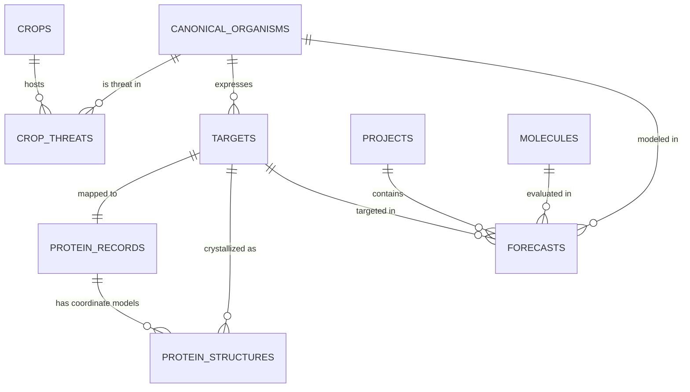

# ResistanceIQ Scientific Knowledge Graph Architecture

## 1. Overview
The ResistanceIQ Knowledge Graph establishes end-to-end biological and agronomic traceability across six key scientific tiers:

```
CROP (FAO ICC & NCBI Taxonomy)
  │
  └──▶ THREAT (EPPO / CABI Pest Host Matrix)
         │
         └──▶ TARGET (IRAC MoA & Biological Receptor)
                │
                └──▶ PROTEIN (Swiss-Prot Sequence & Active Sites)
                       │
                       └──▶ STRUCTURE (RCSB PDB & AlphaFold DB)
                              │
                              └──▶ CANDIDATE MOLECULE (SMILES & ECFP4)
                                     │
                                     └──▶ ML RESISTANCE FORECAST
```

---

## 2. Relational Schema & Entity Graph



---

## 3. Database Entities & Tables

### 1. `crops` (Canonical Crop Master)
- `id`: Unique identifier (e.g. `crop_fao_0121_tomato`)
- `common_name`: Primary English common name (e.g. `Tomato`)
- `scientific_name`: Botanical binomial name (e.g. `Solanum lycopersicum`)
- `family`, `genus`, `species`: Taxonomic hierarchy
- `crop_code`: FAO ICC 4-digit classification code (e.g. `0121`)
- `ncbi_tax_id`: Resolved NCBI Taxonomy ID (`4081`)
- `taxonomy_status`: `"RESOLVED"` or `"UNRESOLVED"`
- `source`: `"FAO Indicative Crop Classification (ICC) v1.1"`

### 2. `crop_threats` (Crop-Threat Association Edge)
- `id`: Relationship ID (e.g. `ct_tomato_aphid`)
- `crop_id`: Foreign key to `crops.id`
- `organism_id`: Foreign key to `pests.id` / `canonical_organisms.id`
- `organism_name`: Scientific species name (e.g. `Myzus persicae`)
- `relationship`: Host type (`"PRIMARY_HOST"`, `"SECONDARY_HOST"`, `"VECTOR"`)
- `source`: `"EPPO Global Database / CABI CPC"`
- `evidence_level`: `"FIELD_OBSERVED"`

### 3. `targets` (Biological Receptors)
- `id`: Target ID (e.g. `tgt_ache1_01`)
- `name`: Full biochemical receptor name (`Acetylcholinesterase 1 (AChE1)`)
- `gene_name`: Validated gene abbreviation (`ace-1`)
- `uniprot_id`: Swiss-Prot accession (`Q9BMJ1`)
- `irac_moa_group`: Mode of Action classification (`1A`)
- `resistance_mechanism`: Documented mutation patterns (`G119S, F331W`)

### 4. `protein_records` (UniProt Metadata)
- `id`: Protein record ID (`prot_Q9BMJ1`)
- `uniprot_accession`: Unique accession key (`Q9BMJ1`)
- `sequence`: Full un-truncated canonical amino acid sequence
- `sequence_length`: Number of residues (`647`)
- `active_sites_json`: Catalytic triad, choline gorge, acyl loop pocket coordinates

### 5. `protein_structures` (3D Coordinate Models)
- `id`: Structure record ID (`str_1qon_A`)
- `uniprot_accession`: UniProt accession (`Q9BMJ1`)
- `pdb_id`: 4-character PDB code (`1QON` or `NULL` if computed)
- `structure_type`: `"EXPERIMENTAL"`, `"COMPUTED"`, or `"UNAVAILABLE"`
- `structure_source`: `"RCSB_PDB"` or `"ALPHAFOLD_DB"`
- `experimental_method`: `"X-RAY DIFFRACTION"`, `"CRYO-EM"`, etc.
- `resolution`: Float Ångström measurement (`2.20`)

---

## 4. REST Query Endpoints
- `GET /api/v1/crops`: Search crops with fast indexing
- `GET /api/v1/crops/{id}`: Single crop metadata
- `GET /api/v1/crops/{id}/threats`: Pests associated with the crop
- `GET /api/v1/targets?organism_id=...`: Validated targets for threat
- `GET /api/v1/targets/{id}/protein`: Complete UniProt sequence and annotations
- `GET /api/v1/targets/{id}/structures`: Prioritized 3D coordinate models
- `GET /api/v1/admin/knowledge-graph/status`: Live graph node/edge counts
- `POST /api/v1/admin/knowledge-graph/sync`: Admin synchronization trigger
