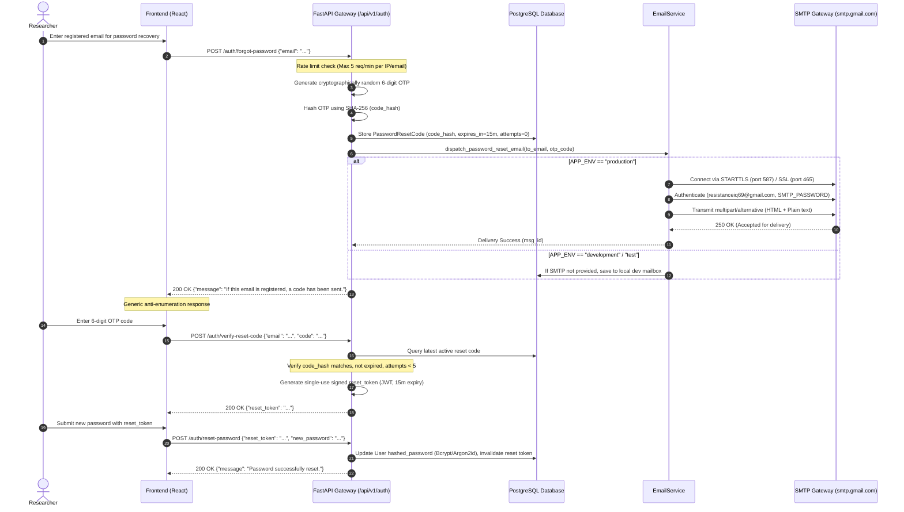

# ResistanceIQ — Step 27 Production Email & SMTP Infrastructure Guide

**Subsystem**: ResistanceIQ Transactional Email & Password Recovery Engine  
**Production Transport**: External Authenticated SMTP (STARTTLS / SSL) / Transactional HTTPS API  
**Primary Project Email**: `resistanceiq69@gmail.com`  
**Security Posture**: Fail-Closed Isolation in Production  

---

## 1. Architecture & Email Dispatch Lifecycle



---

## 2. Environment Configuration

### Production Settings:
```bash
APP_ENV=production
EMAIL_PROVIDER=smtp
SMTP_HOST=smtp.gmail.com
SMTP_PORT=587
SMTP_USERNAME=resistanceiq69@gmail.com
SMTP_PASSWORD=your-16-char-gmail-app-password
SMTP_FROM_EMAIL=resistanceiq69@gmail.com
SMTP_FROM_NAME=ResistanceIQ Security
SMTP_USE_TLS=true
```

### Production Security Invariants:
1. **Zero Cleartext Credentials**: `SMTP_PASSWORD` is injected strictly via environment variables; never logged or committed.
2. **Fail-Closed Gate**: If `APP_ENV=production` and SMTP credentials are missing or invalid, email dispatch fails explicitly and dev mailbox storage is rejected.
3. **Anti-Enumeration Protection**: `POST /auth/forgot-password` returns status 200 with identical generic response regardless of whether the email exists in the database.
4. **OTP Brute-Force Rate Limiting**: Max 5 attempts per OTP code before the reset code is permanently invalidated.
5. **Single-Use Authorization**: Reset tokens are cryptographically single-use and expire within 15 minutes.
