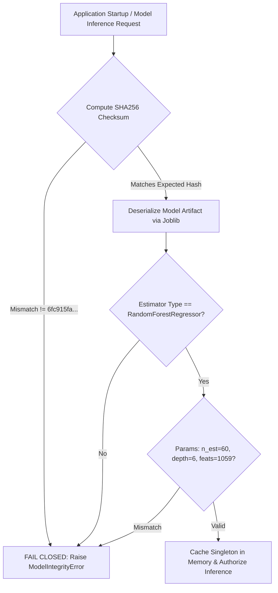

# ResistanceIQ — Step 27 ML Model Deployment & Cryptographic Governance

**Artifact Identifier**: `v2.0.0-gbrt-ecfp4.joblib`  
**Storage Location**: `resistanceiq/storage/models/v2.0.0-gbrt-ecfp4.joblib`  
**Expected SHA256**: `6fc915fa26716dc4a06bad71f586af95ee071acf11e9a5b8acdc5171fed55622`  
**Scientific Governance**: REQUIRES VALIDATION  
**Operational Mode**: RESEARCH / VALIDATION MODE  

---

## 1. Immutable Model Architecture & Invariants

The ResistanceIQ production benchmark model is an immutable serialized joblib bundle combining:
- **Base Estimator**: `RandomForestRegressor` ensemble
  - `n_estimators`: `60`
  - `max_depth`: `6`
  - `random_state`: `42`
  - `n_features_in_`: `1059`
- **Cheminformatics Feature Pipeline**: 1024-bit Morgan ECFP4 fingerprint vectors + 6 RDKit physicochemical descriptors + IRAC/NCBI/Bioassay categorical encodings.
- **Split Conformal Predictor**: Calibrated non-conformity score quantile bounds ($\alpha = 0.10 \to 90\%$ coverage guarantee).
- **Applicability Domain / OOD Detector**: Tanimoto maximum neighbor similarity manifold and Mahalanobis feature space distance.

---

## 2. Cryptographic Startup & Inference Gate

Every model load operation executes an uncompromising multi-stage validation check:

### Failure Behavior:
If any checksum or structural characteristic fails:
- Application immediately refuses inference requests.
- Returns standardized `HTTP 503 Service Unavailable` with `MODEL_INTEGRITY_FAILURE`.
- Zero automatic downloading or silent substitution of model weights.

---

## 3. Scientific Governance & Regulatory Boundary

> **RESEARCH MODE DISCLAIMER**  
> Candidate machine learning models deployed within ResistanceIQ operate strictly under **RESEARCH / VALIDATION MODE**.  
> Status: **REQUIRES VALIDATION**.  
> Predictions are computational hypothesis generation tools and are **NOT** regulatory certifications for crop protection products. Laboratory bioassays and standardized IRAC susceptibility tests are mandatory prior to field application.
