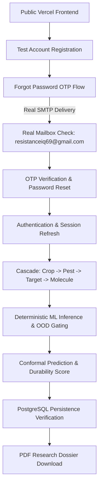

# ResistanceIQ — Step 28 Live Production Verification Protocol

**System**: ResistanceIQ Public Cloud Deployment  
**Scope**: Authentication, SMTP OTP Delivery, ML Pipeline, Conformal Interval, Dossier Export  

---

## 1. End-to-End Verification Procedures

### Verification Test Matrix:

| Test Case ID | Description | Target Component | Expected Result |
|---|---|---|---|
| **LIVE-AUTH-01** | Test Researcher Registration | `/api/v1/auth/register` | 201 Created with JWT access token |
| **LIVE-AUTH-02** | Test Login & Token Storage | `/api/v1/auth/login` | 200 OK, token stored in `localStorage` |
| **LIVE-AUTH-03** | Test SPA Refresh & Session Persistence | Frontend `/` | User remains authenticated across reloads |
| **LIVE-SMTP-01** | Forgot Password Request | `/api/v1/auth/forgot-password` | 200 OK, 6-digit OTP generated |
| **LIVE-SMTP-02** | Real Mailbox Dispatch | `smtp.gmail.com:587` | Real email arrives at destination inbox |
| **LIVE-SMTP-03** | OTP Verification & Token Issue | `/api/v1/auth/verify-reset-code` | 200 OK, single-use reset token returned |
| **LIVE-SMTP-04** | Password Reset & Re-Login | `/api/v1/auth/reset-password` | Old password rejected; new password logins |
| **LIVE-ML-01** | Crop Threat Target Cascade | `/api/v1/knowledge-graph/` | Full taxonomy & target hierarchy loaded |
| **LIVE-ML-02** | Standard Molecular Forecast | `/api/v1/forecast/predict` | 1059 features, conformal intervals returned |
| **LIVE-ML-03** | Out-of-Domain Detection | Novel SMILES input | OOD flag marked `True`, warning banner shown |
| **LIVE-DB-01** | Forecast Record Persistence | Supabase PostgreSQL | Record retrievable via `GET /forecasts/{id}` |
| **LIVE-EXP-01** | PDF Research Dossier Export | `/api/v1/reports/generate` | Valid PDF downloaded with SHA256 checksum |
| **LIVE-SEC-01** | Unauthenticated Access Gate | Protected endpoints | 401 Unauthorized with WWW-Authenticate header |
| **LIVE-SEC-02** | Cross-Origin Request Block | Unauthorized domain | CORS origin rejection |
