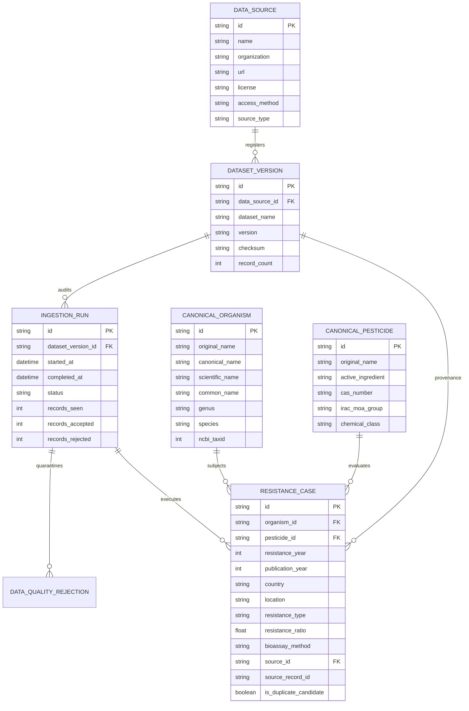

# ResistanceIQ — Canonical Scientific Data Model

## 1. Entity Relationship Overview

---

## 2. Field Dictionary & Provenance Traceability

Every record in `resistance_cases` maintains full cryptographic and structural traceability:
- Traced to its originating external database via `source_id` + `source_record_id`.
- Traced to its exact batch snapshot via `dataset_version_id` (with SHA-256 raw file hash).
- Traced to its execution log and timestamp via `ingestion_run_id`.
- Retains original non-normalized names in `canonical_organisms.original_name` and `canonical_pesticides.original_name`.
