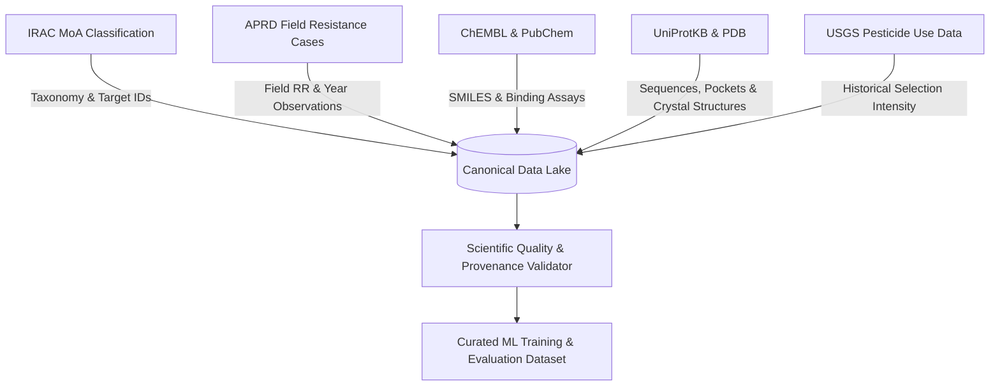

# ResistanceIQ — Scientific Data Sources Assessment

This document investigates legitimate public and open scientific data sources for pesticide resistance forecasting, evaluating their data quality, coverage, licensing, API availability, and suitability for model training.

---

## 1. Primary Empirical Resistance Databases

### 1.1 APRD (Arthropod Pesticide Resistance Database)
* **Organization**: Michigan State University / USDA NIFA / IRAC
* **URL**: [https://www.pesticideresistance.org](https://www.pesticideresistance.org)
* **Dataset Scope**: Global repository of published cases of pesticide resistance in insects, mites, and ticks from 1914 to present.
* **Data Type**: Species, active ingredient, IRAC class, year, country/state, documented resistance ratio ($RR$), bioassay method, and literature citation.
* **Coverage**: >600 arthropod species, >300 active ingredients, >10,000 documented field resistance cases.
* **Licensing**: Public educational/research resource with attribution.
* **Update Frequency**: Continuous / Quarterly additions from peer-reviewed literature.
* **API / Download Availability**: Web search interface, bulk export available via programmatic scraping or research data request.
* **Relevant Fields**: `Species`, `Compound`, `Class`, `Country`, `First Reported Year`, `Resistance Ratio`, `Reference`.
* **Limitations**: Some historical records contain only binary status without exact numerical $LC_{50}$ values; heavy reporting bias towards heavily managed economic pests.
* **Legal & Model Training Suitability**: **YES — Primary ground-truth training source for field resistance emergence.**

---

### 1.2 IRAC (Insecticide Resistance Action Committee) Database
* **Organization**: Insecticide Resistance Action Committee (CropLife International)
* **URL**: [https://irac-online.org](https://irac-online.org)
* **Dataset Scope**: Global authoritative Mode of Action (MoA) classification scheme, standardized susceptibility testing methods, and cross-resistance matrices.
* **Data Type**: Mode of action groups (1A–35), target site protein designations, chemical sub-groups, standardized test method protocols (#001–#032).
* **Coverage**: All commercially registered insecticides, acaricides, and nematicides globally.
* **Licensing**: Open access with IRAC attribution.
* **Update Frequency**: Annual MoA classification update (currently Version 11.1).
* **API / Download Availability**: Downloadable CSV/XLSX tables and interactive search tools.
* **Relevant Fields**: `IRAC Group`, `Target Site / Receptor`, `Chemical Sub-group`, `Active Ingredient List`.
* **Limitations**: Does not publish raw field test data; provides the structural taxonomy and target mapping framework.
* **Legal & Model Training Suitability**: **YES — Mandatory taxonomy layer for target assignment and cross-resistance mapping.**

---

## 2. Chemical & BioAssay Repositories

### 2.1 ChEMBL
* **Organization**: European Molecular Biology Laboratory (EMBL-EBI)
* **URL**: [https://www.ebi.ac.uk/chembl/](https://www.ebi.ac.uk/chembl/)
* **Dataset Scope**: Curated bioactivity database of drug-like and agrochemical molecules.
* **Data Type**: Curated 2D/3D chemical structures (SMILES, InChI, Molfile), experimental binding affinities ($K_i, K_d, IC_{50}, EC_{50}$), mutant protein bioassays.
* **Coverage**: >2.4 million distinct chemical compounds, >15,000 biological targets.
* **Licensing**: Creative Commons Attribution-ShareAlike 3.0 Unported (CC BY-SA 3.0).
* **Update Frequency**: Biannual releases.
* **API / Download Availability**: REST API, Python client (`chembl_webresource_client`), and complete downloadable PostgreSQL dumps.
* **Relevant Fields**: `canonical_smiles`, `standard_type`, `standard_value`, `standard_units`, `target_chembl_id`, `assay_type`.
* **Limitations**: Agrochemical assays represent a smaller fraction of the database compared to human pharmaceutical assays; require filtering for insect targets.
* **Legal & Model Training Suitability**: **YES — Core source for molecular structure normalization and baseline binding affinity features.**

---

### 2.2 PubChem
* **Organization**: National Center for Biotechnology Information (NCBI / NIH)
* **URL**: [https://pubchem.ncbi.nlm.nih.gov/](https://pubchem.ncbi.nlm.nih.gov/)
* **Dataset Scope**: World's largest open chemical database containing compound records and High-Throughput Screening (HTS) bioassays.
* **Data Type**: 3D conformers, computed physicochemical descriptors, high-throughput agrochemical screening assays.
* **Coverage**: >115 million chemical compounds, >1.5 million bioassays.
* **Licensing**: Public Domain (CC0 / US Government work).
* **Update Frequency**: Daily / Weekly updates.
* **API / Download Availability**: PUG-REST API, PUG-View, bulk SDF/XML FTP downloads.
* **Relevant Fields**: `CID`, `Canonical SMILES`, `Molecular Weight`, `XLogP`, `Hydrogen Bond Donors/Acceptors`, `BioAssay AID`.
* **Limitations**: Uncurated depositor assays can introduce experimental noise.
* **Legal & Model Training Suitability**: **YES — Primary source for chemical identifier resolution (CAS to SMILES) and bulk molecular properties.**

---

## 3. Genomic & Protein Target Structure Databases

### 3.1 UniProtKB / Swiss-Prot
* **Organization**: UniProt Consortium (EMBL-EBI, SIB, PIR)
* **URL**: [https://www.uniprot.org/](https://www.uniprot.org/)
* **Dataset Scope**: Comprehensive, high-quality, and freely accessible protein sequence and functional annotation database.
* **Data Type**: Amino acid sequences, active site residue annotations, natural variants / resistance mutations, cross-references to PDB and AlphaFold.
* **Coverage**: Complete proteomes for key agricultural pests (*Myzus persicae*, *Helicoverpa armigera*, *Plutella xylostella*, *Tetranychus urticae*, *Spodoptera frugiperda*).
* **Licensing**: Creative Commons Attribution (CC BY 4.0).
* **Update Frequency**: Monthly releases.
* **API / Download Availability**: REST API, FASTA downloads, XML/JSON dumps.
* **Relevant Fields**: `Entry`, `Protein names`, `Gene Names`, `Organism`, `Sequence`, `Mutagenesis annotations`, `Binding site positions`.
* **Legal & Model Training Suitability**: **YES — Ground-truth for target protein sequences, pocket definitions, and mutation alignments.**

---

### 3.2 RCSB Protein Data Bank (PDB)
* **Organization**: Worldwide Protein Data Bank (wwPDB)
* **URL**: [https://www.rcsb.org/](https://www.rcsb.org/)
* **Dataset Scope**: Experimental 3D structures of biological macromolecules determined by X-ray crystallography, Cryo-EM, and NMR.
* **Data Type**: Atomic coordinate files (PDB / mmCIF), ligand co-crystal conformations, electron density maps.
* **Coverage**: Experimental crystal structures of pesticide targets (e.g., Torpedo/Insect AChE complexed with carbamates/organophosphates, Cryo-EM RyR structures, GluCl crystals).
* **Licensing**: Public Domain (CC0).
* **Update Frequency**: Weekly.
* **API / Download Availability**: REST API, GraphQL API, bulk coordinate downloads.
* **Relevant Fields**: `Structure ID`, `Resolution (\AA)`, `Ligand ID`, `Atomic Coordinates`, `Binding pocket residues`.
* **Legal & Model Training Suitability**: **YES — Essential for 3D molecular docking, binding pocket feature generation, and in-silico mutagenesis ($\Delta\Delta G$).**

---

## 4. Agricultural Usage & Survey Databases

### 4.1 USDA NASS & USGS Agricultural Pesticide Use Data
* **Organization**: United States Department of Agriculture (NASS) / US Geological Survey (USGS)
* **URL**: [https://water.usgs.gov/nass_data.html](https://water.usgs.gov/nass_data.html)
* **Dataset Scope**: Annual agricultural pesticide use estimates by compound, crop, year, and US county.
* **Data Type**: High/low estimates of agricultural active ingredient application (kg/year, treated acres).
* **Coverage**: Annual data for >400 active ingredients across the continental United States from 1992 to present.
* **Licensing**: US Public Domain.
* **Update Frequency**: Annual / Multi-year releases.
* **API / Download Availability**: Downloadable CSV tables and GeoTIFF raster maps.
* **Legal & Model Training Suitability**: **YES — Critical context for estimating real-world selection pressure volume.**

---

## 5. Data Source Synthesis & Integration Strategy

