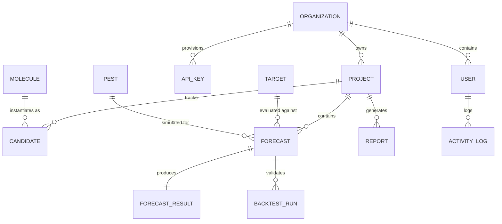

# ResistanceIQ — Database Architecture & Schema

## Overview

The database uses **PostgreSQL** in production with **SQLAlchemy 2.0+** declarative models and **Alembic** versioned schema migrations. All primary keys use UUIDs or string IDs with timestamps (`created_at`, `updated_at`).

---

## Entity Relationship Summary

---

## Core Tables & Schema Specifications

### 1. `organizations`
- `id` (VARCHAR(36), PK)
- `name` (VARCHAR(128), NOT NULL)
- `slug` (VARCHAR(128), UNIQUE, NOT NULL)
- `plan_tier` (VARCHAR(32), DEFAULT 'PRO')
- `created_at` (TIMESTAMP WITH TIME ZONE)

### 2. `users`
- `id` (VARCHAR(36), PK)
- `organization_id` (VARCHAR(36), FK -> `organizations.id`)
- `email` (VARCHAR(255), UNIQUE, NOT NULL)
- `hashed_password` (VARCHAR(255), NOT NULL)
- `full_name` (VARCHAR(128), NOT NULL)
- `role` (ENUM: `ADMIN`, `ANALYST`, `VIEWER`)
- `is_active` (BOOLEAN, DEFAULT TRUE)
- `created_at` (TIMESTAMP WITH TIME ZONE)

### 3. `projects`
- `id` (VARCHAR(36), PK)
- `organization_id` (VARCHAR(36), FK -> `organizations.id`)
- `name` (VARCHAR(255), NOT NULL)
- `description` (TEXT)
- `status` (VARCHAR(32), DEFAULT 'ACTIVE')
- `created_at` (TIMESTAMP WITH TIME ZONE)

### 4. `molecules`
- `id` (VARCHAR(36), PK)
- `chemical_name` (VARCHAR(255), NOT NULL)
- `smiles` (TEXT, NOT NULL)
- `molecular_weight` (FLOAT)
- `logp` (FLOAT)
- `hbd_count` (INTEGER)
- `hba_count` (INTEGER)
- `provenance_source` (VARCHAR(64))
- `created_at` (TIMESTAMP WITH TIME ZONE)

### 5. `targets` (Receptor Conformations)
- `id` (VARCHAR(36), PK)
- `name` (VARCHAR(255), NOT NULL)
- `uniprot_id` (VARCHAR(32), NOT NULL)
- `organism` (VARCHAR(128), NOT NULL)
- `structure_source` (VARCHAR(64), e.g., 'PDB', 'ESMFold', 'AlphaFold2')
- `binding_pocket_residues` (JSON/TEXT)

### 6. `pests` (Species Population Systems)
- `id` (VARCHAR(36), PK)
- `common_name` (VARCHAR(128), NOT NULL)
- `scientific_name` (VARCHAR(128), NOT NULL)
- `generation_time_days` (INTEGER, NOT NULL)
- `typical_population_size` (BIGINT, NOT NULL)
- `baseline_mutation_rate` (FLOAT, NOT NULL)

### 7. `forecasts` & `forecast_results`
- `id` (VARCHAR(36), PK)
- `project_id` (VARCHAR(36), FK -> `projects.id`)
- `molecule_id` (VARCHAR(36), FK -> `molecules.id`)
- `target_id` (VARCHAR(36), FK -> `targets.id`)
- `pest_id` (VARCHAR(36), FK -> `pests.id`)
- `status` (VARCHAR(32), e.g., `PENDING`, `RUNNING`, `COMPLETED`, `FAILED`)
- `durability_score` (FLOAT, 0.00-1.00)
- `estimated_years_to_resistance` (FLOAT)
- `risk_tier` (ENUM: `LOW`, `MODERATE`, `HIGH`, `CRITICAL`)
- `binding_affinity_kcal_mol` (FLOAT)
- `risk_trajectory_json` (JSON/TEXT)
- `mutagenesis_hotspots_json` (JSON/TEXT)
- `model_version` (VARCHAR(32))

### 8. `backtests` & `historical_cases`
- Empirical historical resistance ground-truth from APRD / IRAC.
- `actual_years_to_resistance` vs `predicted_years_to_resistance` for MAE calibration.

### 9. `reports`, `api_keys`, `activity_logs`
- Full audit tracking and programmatic authentication.
