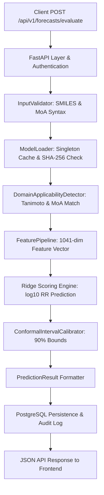

# ResistanceIQ — Real-Time Inference Architecture

## 1. Inference Pipeline Overview

The ResistanceIQ inference engine executes high-throughput, calibrated resistance forecasts from raw SMILES strings and biological context parameters:

---

## 2. Component Responsibilities

1. **`ml.inference.validator.InputValidator`**:
   - Validates SMILES character legality, bracket/parenthesis balancing, and canonicalizes strings.
   - Rejects unparseable chemical structures with standard HTTP 400 status.
2. **`ml.inference.loader.ModelLoader`**:
   - Maintains thread-safe in-memory singleton cache of joblib model binaries.
   - Validates cryptographic SHA-256 checksum upon initial load.
3. **`ml.inference.predictor.ResistancePredictor`**:
   - Evaluates chemical Tanimoto similarity against the training series.
   - Executes feature transformations using frozen training parameters.
   - Computes continuous $\log_{10}(RR)$, derived ordinal risk tier, and durability horizon in years.
4. **`ml.inference.output.PredictionResult`**:
   - Enforces strict Pydantic typed contracts for all returned fields.
