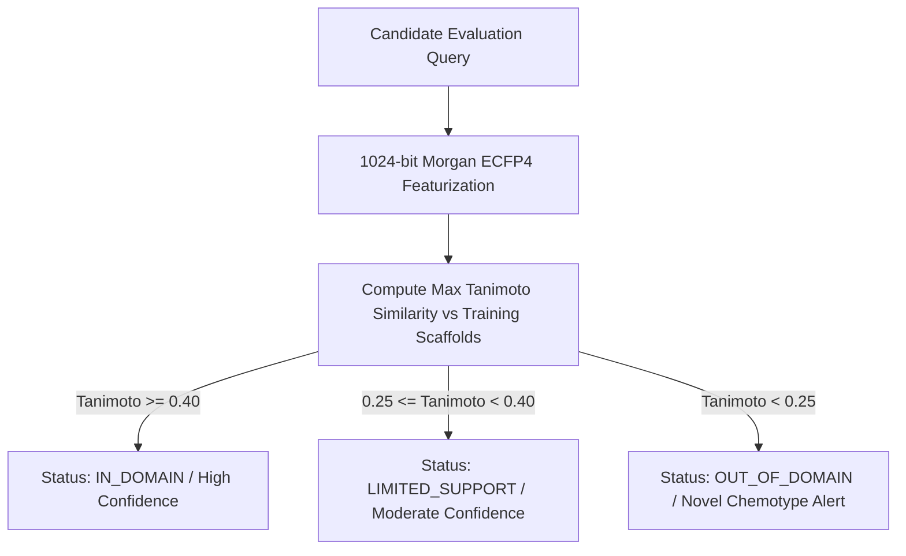

# ResistanceIQ — Machine Learning Model & Prediction Monitoring

## 1. Production Model Tracking Framework

ResistanceIQ monitors real production ML inference along three distinct dimensions:
1. **Operational Health**: Latency, memory utilization, throughput, and error rates.
2. **Input Space Drift**: Morgan Fingerprint Tanimoto similarity distance ($T_{\max} < 0.25$) and taxonomic coverage.
3. **Outcome Validation (Ground-Truth Delayed)**: Evaluated only when real post-2026 field resistance or bioassay data arrives.

---

## 2. Real-Time Input Domain Monitoring

---

## 3. Ground-Truth Calibration & Performance Auditing

- **No Premature Label Drift Flagging**: Model error is never labeled as "drift" without validated laboratory bioassay outcomes.
- **Empirical Coverage Verification**: Conformal Prediction intervals are audited against arriving ground-truth records to verify empirical coverage matches nominal $1 - \alpha = 90\%$ coverage.
- **Retraining Triggers**:
  - Validated $\text{MAE}_{\log_{10}}$ degradation $> 25\%$ over baseline.
  - Ingestion of $> 1,000$ newly validated laboratory bioassay records.
  - Addition of novel IRAC MoA groups (e.g. Group 30, 32).
